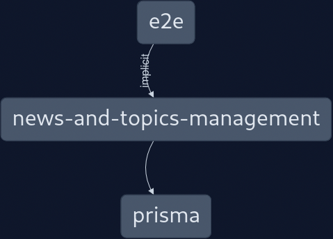

# News And Topics Management API

✨ **Made with Nx, Fastify, and Prisma (Postgres)** ✨


## Postman Documentation

https://documenter.getpostman.com/view/23244223/2s9YC1YaTv

## Setup and start local development of the app

Run `yarn install` to install all dependencies

```shell
yarn install
```

Copy `.env.example` to `.env` and fill in the values

```shell
cp .env.example .env
```

Setup postgres database (here using Docker)

```shell
yarn prepare-db-container
yarn configure-db
```

Run the app

```shell
yarn start
```

Run db client

```shell
yarn prisma-studio
```

## Build the app

```shell
yarn build
```

## Run test

```shell
yarn test
```
